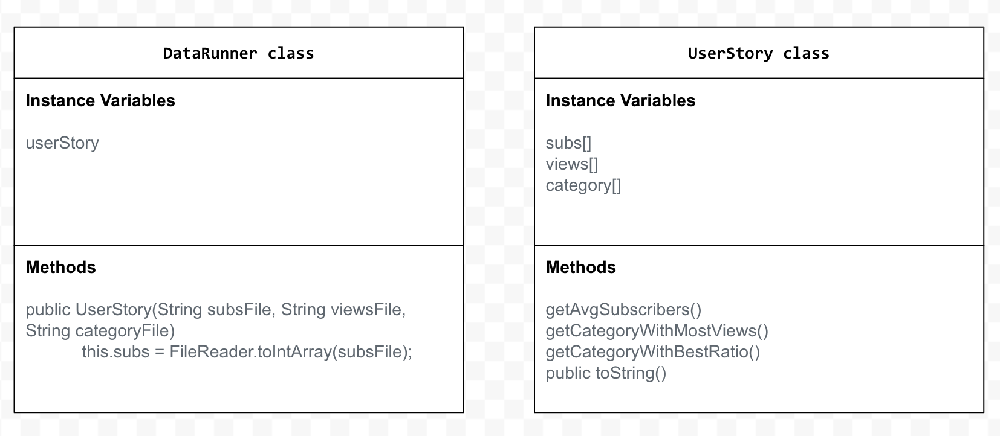

# Unit 3 - Data for Social Good Project 

## Introduction 

Software engineers develop programs to work with data and provide information to a user. Each user has different needs based on the information they are looking for from data. Your goal is to create a data analysis program for your user that stores and analyzes data to provide the information they need. 

## Requirements 

Use your knowledge of object-oriented programming, one-dimensional (1D) arrays, and algorithms to create your data analysis program: 
- **Write a class** – Write a class to represent your user or business and store and analyze their data with no-argument and parameterized constructors. 
- **Create at least two 1D arrays** – Create at least two 1D arrays to store the data that your user needs information about. 
- **Write a method** – Write a method that finds or manipulates the elements in a 1D array to provide the information your user needs. 
- **Implement a toString() method** – Write a toString() method that returns general information about the data (for example, number of values in the dataset). 
- **Document your code** – Use comments to explain the purpose of the methods and code segments and note any preconditions and postconditions. 

## User Story 

> As an Pro Youtuber,   
> I want to make a lot of Youtube videos,   
> so that I can receive a Gold Youtube Button. 

## Dataset 

Dataset: https://docs.google.com/spreadsheets/d/1vP4nwOebYzVQGHiZ2hkBkdAnB9ZwJgf0sj-e_8X3DYQ/edit?usp=sharing 
- **Subs** (int) - number of subscribers a Youtuber has
- **Views** (int) - number of views a video has
- **Categories** (String) - the category in which the video is in

## UML Diagram 

 

## Description 

In our project, the user story that we created is, as a Pro Youtuber, I want to make a lot of Youtube videos, so that I can receive a Gold Youtube Button. Our project works by displaying the best categories that get the most views, best number of subscribers, and the category with the most subscriber-to-view ratio that leads to the Gold Youtube Button. My process of creating this project was that I used the datset which showed each Youtube User and their factors including subscribers, views, likes, and etc, and I traversed all of this information into my coding, which I set as a Text file, and also sorted them into the right files, which included my 1d arrays. My project addressed the dataset in the users goals by taking the following information: Traversed number of subs, traversed number of views, and the category, and we used all of this data to help figure out the best chance for people to receive a Gold Youtube Button. 

